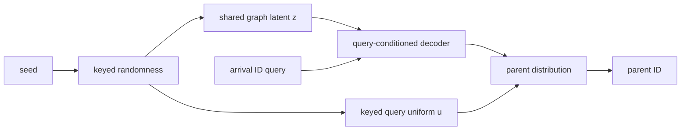

# Seeded random-access graph generation

This folder turns the exploratory conversation behind the project into a stable research record.
The core question is whether a learned distribution over queryable functions can preserve the
joint behavior of a growth process while answering a single arrival-indexed query without replaying
the growth history.

The current artifact is a deliberately small baseline:

- NetworkX supplies fixed-size, arrival-labeled Barabási–Albert trees with `m=1`.
- A VAE encodes complete parent arrays into graph-level Gaussian latents.
- A decoder predicts one parent from a shared latent and an arrival ID.
- At deployment, seeded standard-normal noise replaces the encoder.
- A keyed random draw makes each `(seed, query)` result repeatable and query-order independent.
- An independent-parent baseline preserves arrival-specific marginals while removing shared latent
  structure.

Read [research-question.md](research-question.md) for scope and feasibility,
[architecture.md](architecture.md) for the model and inference contract,
[experiment.md](experiment.md) for evaluation and acceptance criteria, and
[literature.md](literature.md) for prior art and the current novelty boundary. The latest execution
record is in [run-report.md](run-report.md). The expanded mathematical and empirical evaluation
program is in [evaluation-plan.md](evaluation-plan.md).

The executable artifact is [`seeded_pa_vae_demo.ipynb`](../seeded_pa_vae_demo.ipynb). The original
agent handoff remains in [`seeded_pa_vae_notebook_plan.md`](../seeded_pa_vae_notebook_plan.md).
