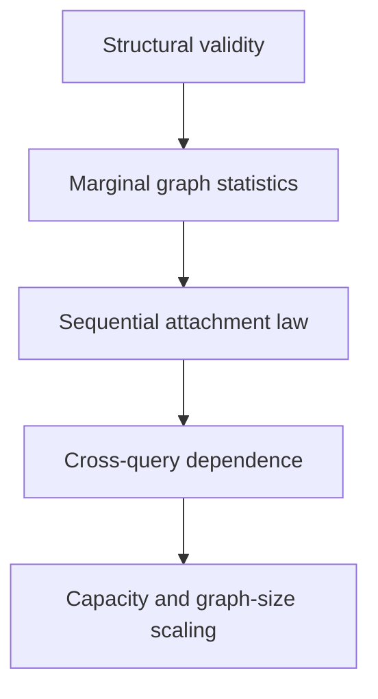

# Deep evaluation plan for the seeded PA VAE

The evaluation should distinguish three increasingly demanding questions:

1. Does the generator produce structurally valid arrival-labeled trees?
2. Does it reproduce ordinary graph-level statistics of Barabási–Albert trees?
3. Does it reproduce the sequential dependence law of preferential attachment, despite answering
   parent queries independently?

The third question is the scientifically interesting one.

## Notation and model setup

This project uses the Barabási–Albert preferential-attachment model. It begins with nodes 1 and 2
connected by one edge. New nodes arrive one at a time. When node \(t\) arrives, it chooses existing
nodes with probability proportional to their current degree.

The parameter \(m\) is the number of edges created by each arriving node. This project currently uses

$$
m=1,
$$

so each new node chooses exactly one older node as its parent. The resulting graph is therefore a
tree. A future experiment with \(m=2\), for example, would give each arriving node two edges and would
no longer produce a tree.

| Symbol | Meaning |
|---|---|
| \(N\) | Final number of nodes in a completed graph; currently 64 |
| \(n\) | Number of nodes at some intermediate stage of growth |
| \(t\) | Arrival ID of the node currently being added or queried |
| \(i,j\) | Particular existing node IDs |
| \(k\) | A degree value, such as degree 1, 2, or 10 |
| \(m\) | Number of older nodes selected by each new node; currently 1 |
| \(P_t\) | Parent selected by arriving node \(t\) |
| \(P\) | Complete parent array \((P_1,\ldots,P_N)\) representing one graph |
| \(D_i(n)\) | Degree of node \(i\) when the graph contains \(n\) nodes |
| \(d_j(t-1)\) | Degree of candidate parent \(j\) immediately before node \(t\) arrives |
| \(N_k(n)\) | Number of nodes having degree \(k\) when the graph contains \(n\) nodes |
| \(D_{\max}\) | Largest node degree in a graph |
| \(E\) | Number of graph edges; for the current trees, \(E=N-1\) |
| \(z\) | Shared latent vector produced from the public seed |
| \(\alpha\) | Exponent of an estimated attachment rule \(A(k)\propto k^\alpha\) |
| \(\mathcal F_t\) | The complete graph history known through time \(t\) |
| \(\mathbf 1\{\cdot\}\) | Indicator: 1 when its condition is true and 0 otherwise |
| \(E[X]\) | Expected or average value of random quantity \(X\) |
| \(P(X)\) | Probability of event or value \(X\); distinct from the parent array when arguments are shown |
| \(\operatorname{Corr}(X,Y)\) | Correlation between quantities \(X\) and \(Y\) across sampled graphs |
| \(\operatorname{Cov}(X,Y)\) | Covariance between quantities \(X\) and \(Y\) across sampled graphs |

“Degree” means the number of edges incident to a node. Because these graphs are undirected, every
edge contributes one degree to each endpoint and therefore contributes two to total degree.

The notation uses uppercase \(N\) for the final graph size and lowercase \(n\) for an intermediate
size. The expression \(N_k(n)\) is unfortunately conventional but distinct from final size \(N\): it
means a count of degree-\(k\) nodes, not “N subscript k nodes in the final graph.”

## 1. Exact structural invariants

For `m=1`, every generated object should have:

- Exactly \(N-1\) edges
- One connected component
- No cycles or self-loops
- Exactly one older parent for every node \(t>1\)
- Mean degree exactly \(\bar d=\frac{2(N-1)}{N}\)

- Zero triangle clustering

The parent representation guarantees most of these properties. They remain important correctness
checks, but they are not evidence that the model learned preferential attachment.

## 2. Exact BA attachment-law evaluation

This should be the highest-priority addition.

Immediately before node \(t\) arrives, there are \(t-1\) nodes and \(t-2\) edges. Consequently,

$$
\sum_j d_j(t-1)=2(t-2).
$$

Under the exact BA process, the probability that node \(t\) selects older node \(j\) is

$$
P(P_t=j\mid P_3,\ldots,P_{t-1})
=\frac{d_j(t-1)}{2(t-2)}.
$$

Although the learned generator does not replay history during inference, we can reconstruct that
history afterward for evaluation.

### BA sequence log probability

For every generated parent array, calculate its probability under the real BA process:

$$
\log p_{\mathrm{BA}}(P)
=\sum_{t=3}^{N}\log\frac{d_{P_t}(t-1)}{2(t-2)}.
$$

Compare the distribution of these scores for:

- Held-out NetworkX graphs
- VAE categorical samples
- Independent-parent samples
- VAE argmax samples

This asks whether the generated attachment sequences look probable under BA. Average BA likelihood
alone is insufficient because a mode-collapsed generator can receive an artificially good score by
emitting only a few highly probable graphs. It must be paired with diversity and distributional tests.

#### What this equation means

The BA process gives us the probability of each parent choice at the moment that choice would have
been made. The probability of the complete parent array is the product of all those step-by-step
probabilities:

$$
p_{\mathrm{BA}}(P)
=\prod_{t=3}^{N}\frac{d_{P_t}(t-1)}{2(t-2)}.
$$

Here, \(P_t\) is the parent actually recorded for node \(t\). The numerator
\(d_{P_t}(t-1)\) is that parent's degree immediately before node \(t\) arrives. The denominator
\(2(t-2)\) is the total degree of all eligible parents at that moment. Their ratio is therefore the
BA probability of the recorded choice.

Multiplying every choice probability gives the probability that a real BA process would generate
that exact arrival-labeled parent array. The calculation starts at \(t=3\) because the edge from node
2 to node 1 is fixed by the initialization rather than sampled.

The logarithmic form is the same calculation written as a sum:

$$
\log(a\times b\times c)=\log a+\log b+\log c.
$$

Logs are used because complete-graph probabilities become extremely small. Adding moderate-sized log
probabilities is more numerically stable and easier to compare than multiplying many tiny numbers. A
less-negative log probability means that the exact graph is more probable under BA; a more-negative
value means that it is less probable.

#### Worked six-node example

Consider the parent array

$$
P=[-1,1,1,1,3,1].
$$

It records these sampled choices:

| Arrival | Recorded parent | Parent degree before arrival | Total degree before arrival | BA probability |
|---:|---:|---:|---:|---:|
| \(t=3\) | 1 | 1 | 2 | \(1/2\) |
| \(t=4\) | 1 | 2 | 4 | \(2/4=1/2\) |
| \(t=5\) | 3 | 1 | 6 | \(1/6\) |
| \(t=6\) | 1 | 3 | 8 | \(3/8\) |

The probability of this exact parent sequence under BA is

$$
p_{\mathrm{BA}}(P)
=\frac12\times\frac12\times\frac16\times\frac38
=\frac1{64}.
$$

Its log probability is

$$
\log p_{\mathrm{BA}}(P)=\log(1/64)\approx-4.159.
$$

This does not mean that \(1/64\) of all six-node graphs have this shape. It is the probability of this
specific arrival-labeled parent sequence under the exact initialization and growth rule used here.

#### What we compare

Generate thousands of graphs from each method. For every graph, ignore how it was generated and score
its parent array using the same BA equation above. Each collection then produces a distribution of BA
log probabilities.

For example, a summary might look conceptually like this:

| Collection | Median BA log probability | Interpretation |
|---|---:|---|
| NetworkX reference | \(-180\) | Typical score for genuine finite-size BA graphs |
| VAE | \(-183\) | Similar typical BA plausibility |
| Independent parent | \(-210\) | Often makes sequences that BA itself considers unusual |
| Argmax VAE | \(-150\) | Suspiciously high; may repeatedly emit a few easy modes |

These numbers are illustrative, not expected results. The actual comparison should include overlaid
histograms or empirical cumulative distribution curves, means, medians, quantiles, and a distribution
distance such as Wasserstein distance. Because all current graphs have the same \(N\), their raw scores
are directly comparable. Across different graph sizes, use log probability per sampled arrival,

$$
\frac{\log p_{\mathrm{BA}}(P)}{N-2},
$$

because larger graphs necessarily contain more negative log-probability terms.

The NetworkX score distribution is the target. A faithful generator should reproduce that complete
distribution, rather than merely maximize the score:

- Scores much lower than NetworkX indicate BA-unlikely attachment sequences.
- A similar score distribution is encouraging but does not prove the graph distribution matches.
- Scores substantially higher than NetworkX can indicate mode collapse, not superior BA behavior.
- Matching only the mean can hide incorrect variance, tails, or multiple modes.

For example, a generator that always emits the single most probable graph could achieve an excellent
average BA log probability while completely failing to reproduce BA's diversity. Conversely, many
different graphs can share similar log probabilities. This is why BA likelihood must be combined with
degree, dependency, geometry, and diversity measurements.

### Attachment-kernel recovery

This experiment asks:

> If one possible parent currently has twice as many edges as another, is it approximately twice as
> likely to receive the new edge?

**Attachment** means that a newly arriving node connects to an older node. A node's **attractiveness**
is the numerical weight used when choosing among those older nodes. An **attachment kernel** is simply
a function that converts current degree into attractiveness:

$$
A(k)=\text{attractiveness assigned to a node whose current degree is }k.
$$

The symbol \(A\) stands for attractiveness and \(k\) is a degree. Once every candidate has an
attractiveness, its selection probability is its own weight divided by the total weight:

$$
P(\text{parent}=j)
=\frac{A(d_j)}{\sum_{\ell<t}A(d_\ell)}.
$$

Here, \(j\) is one candidate parent, \(d_j\) is its current degree, and \(\ell\) runs through every
older candidate node. The BA model uses

$$
A(k)=k.
$$

In plain language, attractiveness equals degree. Suppose the eligible parents currently have degrees

$$
[1,1,2,4].
$$

Their BA attractiveness weights are also \([1,1,2,4]\), with total weight 8. Their selection
probabilities are

$$
\left[\frac18,\frac18,\frac28,\frac48\right].
$$

The degree-4 node is therefore four times as likely to be selected as either degree-1 node.

The broader family

$$
A(k)=k^\alpha
$$

lets us describe weaker or stronger rich-get-richer behavior. The exponent \(\alpha\) changes how
strongly degree affects attractiveness:

| \(\alpha\) | Attractiveness rule | Degree 4 compared with degree 1 |
|---:|---|---|
| 0 | \(A(k)=1\) | Equally attractive; degree is ignored |
| 0.5 | \(A(k)=\sqrt{k}\) | 2 times as attractive |
| 1 | \(A(k)=k\) | 4 times as attractive; this is linear BA |
| 2 | \(A(k)=k^2\) | 16 times as attractive |

Thus \(\alpha<1\) means weaker reinforcement than BA, \(\alpha=1\) means linear BA reinforcement,
and \(\alpha>1\) means stronger concentration around established hubs.

The word **empirical** means that we estimate this rule from generated graphs rather than assuming
which rule produced them. The parent arrays preserve arrival order, so for evaluation we can replay
each graph. Before each arrival we record all candidate degrees and which candidate was selected.

For a proposed value of \(\alpha\), the probability assigned to the parent actually recorded at time
\(t\) is

$$
P_\alpha(P_t\mid\text{current graph})
=\frac{d_{P_t}^{\alpha}}{\sum_{j<t}d_j^{\alpha}}.
$$

We calculate this probability for every attachment and find the \(\alpha\) that makes all observed
choices collectively most probable:

$$
\widehat\alpha
=\underset{\alpha}{\operatorname{argmax}}
\sum_{\text{graphs}}\sum_{t=3}^{N}
\log P_\alpha(P_t\mid\text{current graph}).
$$

The hat in \(\widehat\alpha\) means “estimated.” `argmax` means “the value of \(\alpha\) that gives
the largest score.” An initial implementation can simply try values from 0 through 2 in small steps
and retain the best-scoring one.

Estimate \(\alpha\) separately for each graph collection:

- NetworkX should produce an estimate near 1, confirming that the estimator works at this graph size.
- A VAE estimate near the NetworkX estimate suggests the correct strength of reinforcement.
- A lower VAE estimate means hubs attract later edges too weakly.
- A higher VAE estimate means hubs attract later edges too strongly.
- The independent baseline need not yield exactly zero because average popularity and arrival ID are
  still related; it remains a useful negative comparison rather than a mathematical \(\alpha=0\)
  generator.

Plot total log probability against every candidate \(\alpha\), not only the winning estimate. A broad,
flat peak means the data do not identify \(\alpha\) precisely. A narrow peak is stronger evidence.
Bootstrap entire graphs to obtain uncertainty intervals.

### Selected-parent degree distribution

This is a calibration test by **degree class**. A degree class is simply the collection of eligible
parents that currently have the same number of edges. For example, “degree class 2” means all
candidate parents that currently have exactly two edges. This test asks whether the generator selects
each such class as often as BA predicts from the states the generator itself created.

Given a graph state containing \(N_k(t-1)\) degree-\(k\) nodes, BA predicts

$$
P(K_{\mathrm{parent}}=k\mid\mathcal F_{t-1})
=\frac{kN_k(t-1)}{2(t-2)}.
$$

Aggregate the expected and observed selections by current parent degree. This tests the attachment
mechanism more directly than comparing final degree histograms.

**Question:** Given the actual state of a generated graph, does it select a degree class as often as
the BA rule says it should?

Suppose a state has four degree-1 nodes, three degree-2 nodes, and one degree-4 node. Its total degree
is

$$
4(1)+3(2)+1(4)=14.
$$

BA assigns total probability \(4/14\) to degree 1, \(6/14\) to degree 2, and \(4/14\) to degree 4.
The one degree-4 node therefore has as much total probability as all four degree-1 nodes.

For every state, add these BA probabilities to expected-count bins and add the actual selected parent
to an observed-count bin. Compare observed divided by expected counts for every degree. Ratios near one
indicate calibration. Ratios below one at high degree mean the generated sequence under-selects hubs
relative to what BA would do in that same state.

## 3. Degree-distribution laws

The **degree distribution** answers: if we choose one node uniformly from a completed graph, what is
the probability it has 1 edge, 2 edges, 3 edges, and so on? The symbol \(p_k\) means the probability
of degree \(k\); it is not a parent-selection probability.

For each collection (NetworkX, VAE, and the independent baseline), replay each parent array to obtain
the degrees in its **completed** graph. If graph \(g\) has \(N_{g,k}\) nodes of degree \(k\), and the
collection has \(G\) graphs of \(N\) nodes each, the plotted empirical probability mass function is

$$
\widehat p_k=\frac{1}{GN}\sum_{g=1}^{G}N_{g,k}.
$$

This is the fraction of all completed-graph nodes in that collection that have degree \(k\). It is
also the average of the per-graph degree fractions, since the graphs all have the same size. The PMF
plot has node degree \(k\) on the horizontal axis and \(\widehat p_k\) on the vertical axis.

The complementary cumulative distribution function (CCDF) uses those **same** counts:

$$
\widehat P(D\ge k)=\sum_{j\ge k}\widehat p_j.
$$

Its horizontal axis is the threshold \(k\), and its vertical axis is the fraction of nodes with at
least \(k\) edges. The PMF and CCDF contain the same information; the CCDF collects sparse high-degree
bins into a tail probability, making that part easier to read. Neither plot uses the attachment
probabilities from the previous section. Both plots use a logarithmic vertical scale so small tail
fractions can be compared; zero fractions cannot appear on a log scale.

For the conventional BA model with \(m=1\), the asymptotic degree distribution is

$$
p_k=\frac{4}{k(k+1)(k+2)},
$$

and therefore

$$
p_k\sim 4k^{-3}.
$$

The general formula is

$$
p_k=\frac{2m(m+1)}{k(k+1)(k+2)}.
$$

This is the limiting BA degree fraction as graph size grows, not the exact expected fraction for a
64-node graph. It appears as a dashed reference on the PMF plot. Equal-sized NetworkX samples are the
primary practical comparison for the VAE, and the exact finite-size recurrence below provides a
mathematical comparison at \(N=64\). This asymptotic form is more informative than fitting a straight
line to a log-log plot. The
derivation appears in the [Albert and Barabási review](https://www.barabasi.com/media/pub_imports/files/103.pdf).

Compare:

- Probability mass at every degree \(k\)
- The cumulative distribution \(P(D\ge k)\)
- Total variation distance over degree bins
- Tail mass above chosen thresholds
- Counts of degree-1, degree-2, and degree-3 nodes
- The complete maximum-degree distribution

At \(N=64\), the asymptotic law is not the true finite-size target. Equal-sized NetworkX samples
should remain the primary reference, with the asymptotic formula used as a secondary convergence
check.

The third plot summarizes a different quantity: for each completed graph, record its largest node
degree, then plot the fraction of graphs with each possible maximum. Its horizontal axis is maximum
degree **per graph**, and its vertical axis is fraction of graphs. Two methods can have nearly identical
pooled PMFs but different maximum-degree distributions: the pooled PMF loses information about how
high-degree nodes are grouped within individual graphs.

The implementation also reports \(\widehat P(D\ge5)\) and \(\widehat P(D\ge10)\) as tail masses,
the degree-1 through degree-3 counts for each graph, and total variation distance
\(\frac12\sum_k|\widehat p_k^{\mathrm{method}}-\widehat p_k^{\mathrm{NetworkX}}|\).
A tail mass of 0.021 at threshold 10 means about 2.1% of completed-graph nodes have degree at least
10. Total variation (TV) summarizes the gap between two PMFs: for example, TV of 0.04 means about
4% of probability mass would need to move between degree bins to make the pooled distributions match.
TV is zero for NetworkX by definition; smaller values mean closer pooled degree distributions, but do
not establish that the methods generate the same whole-graph distribution.

**Question:** Does a uniformly selected generated node have the same degree distribution as a BA node?

Count degree-1, degree-2, and higher-degree nodes in every completed graph, then pool those counts. For
\(m=1\), the asymptotic law gives

$$
p_1=\frac{4}{1\cdot2\cdot3}=\frac23,
\qquad
p_2=\frac{4}{2\cdot3\cdot4}=\frac16.
$$

Compare VAE and baseline frequencies primarily with equal-sized NetworkX graphs; use the asymptotic
law as a secondary reference. Compare low-degree mass, cumulative tail mass, and total variation.
Too few leaves with too many middle-degree nodes means the VAE is smoothing the distribution. Too
much tail mass indicates overly dominant hubs.

### Exact finite-size expected degree counts

This replaces an infinite-graph approximation with an exact average for the size we actually test.
The count \(N_k(n)\) varies between graphs: one graph may have 40 degree-1 nodes and another may have
44. The expectation \(E[N_k(n)]\) is the average count over repeated BA graphs of size \(n\).

We can recursively compute the expected number \(E[N_k(n)]\) of degree-\(k\) nodes. For \(n\)
existing nodes,

$$
E[N_1(n+1)]
=E[N_1(n)]+1-\frac{E[N_1(n)]}{2(n-1)},
$$

and for \(k\ge2\),

$$
E[N_k(n+1)]
=E[N_k(n)]+\frac{(k-1)E[N_{k-1}(n)]-kE[N_k(n)]}{2(n-1)}.
$$

These recurrences provide a fair mathematical target at \(N=16,32,64,\ldots\). They also give an
exact expected leaf fraction, which is useful because the current VAE's leaf fraction was noticeably
lower than the NetworkX reference.

**Question:** Does the average generated degree-count vector match the exact expectation for this
finite graph size and initialization?

Start the recurrence with two degree-1 nodes,

$$
E[N_1(2)]=2,
$$

and advance it until size \(N\). For each generator, subtract the exact expected count from the mean
observed count:

$$
\operatorname{residual}_k
=\operatorname{mean\ generated\ count}_k-E[N_k(N)].
$$

Plot residuals by degree with uncertainty across graphs. NetworkX should fluctuate around zero, which
also checks that the recurrence matches our simulator convention. VAE residuals show exactly where it
puts more or fewer nodes than BA expects **per completed graph**. For example, a residual of +2 at
degree 2 means two extra degree-2 nodes on average in a 64-node graph, or 2/64 = 3.125 percentage
points more nodes in that bin. A negative residual at degree 1 means too few leaves. Because every
graph has 64 nodes and 63 edges, residuals must sum to zero both as node counts and when weighted by
degree; positive low-degree residuals are balanced elsewhere.

The plot focuses on degrees 1 through 15. At higher degrees, expected counts per exact degree are
small, so a line near zero can hide meaningful differences in how often graphs form hubs. Use the
maximum-degree distribution and cumulative tail mass above for that question. This residual plot is
most useful for locating low-degree discrepancies and checking the finite-size recurrence against
NetworkX; it does not, by itself, identify the attachment mechanism.

## 4. Degree growth by node age

Here, **age** means arrival order. Node 1 is oldest and node \(N\) is youngest. Older nodes have had
more chances to receive edges. The expression \(D_i(N)\) is the final degree of the specific node with
arrival ID \(i\), not the degree of an arbitrary node.

Mean-field theory predicts approximately

$$
E[D_i(N)]\propto\sqrt{\frac{N}{i}}.
$$

This age advantage is why early nodes tend to become hubs. Evaluate:

- \(E[D_i(N)]\) for each fixed arrival ID \(i\)
- The full distribution of \(D_i(N)\), especially for nodes 1 through 10
- Variance and quantiles rather than only the mean
- Degree trajectories \(D_i(t)\) over intermediate times
- The rescaled degree \(D_i(N)\sqrt{i/N}\)

For the exact initialization used in this repository, finite-size expectations can be calculated
numerically from

$$
E[D_i(n+1)]
=E[D_i(n)]\left(1+\frac{1}{2(n-1)}\right).
$$

Nodes 1 and 2 require separate initial handling because both begin in the initial edge. Fixed-vertex
degree distributions and their scaling limits are studied by
[Peköz, Röllin, and Ross](https://arxiv.org/abs/1108.5236).

**Question:** Does the VAE reproduce both the average advantage and graph-to-graph variability of
early arrivals?

For every arrival ID \(i\), collect its final degree across graphs. Compare NetworkX and VAE means,
standard deviations, and quantiles. The mean curve can look excellent even if VAE variation is too
small. The displayed comparison focuses on two readable views:

- For the first ten arrival IDs, plot mean final degree **minus the exact BA expectation**. Error bars
  are approximate 95% intervals for each estimated mean across independently generated graphs. Zero
  means agreement in the mean; an interval crossing zero gives little evidence of a difference at
  that node. These intervals are not the spread of individual graph outcomes.
- For node 1, plot the empirical cumulative distribution of its final degree. At degree \(d\), the
  vertical value is the fraction of graphs in which node 1 finishes with at most \(d\) edges. A curve
  shifted left indicates a less dominant root; differences in steepness show differences in
  graph-to-graph variability.

The function also returns the full per-node means, standard deviations, quantiles, mean trajectories,
and rescaled degrees for further inspection. The rescaling is

$$
D_i(N)\sqrt{\frac{i}{N}}.
$$

The square-root age law predicts that this rescaling should reduce the systematic dependence on
arrival ID. A remaining upward or downward trend reveals an age-scaling mismatch, but values for late
arrivals tend toward one because those nodes had little time to gain edges. It is therefore not a
useful standalone plot for this 64-node comparison.

## 5. Reinforcement and temporal dependence

The current root correlation is a useful first measurement, but it examines only one node and one
split point.

### Multiple nodes and split times

**Reinforcement** means that an early attachment increases a node's degree, which increases its chance
of receiving later attachments. The split separates “success so far” from “additional success later.”
It does not provide history to the VAE; it measures whether separately recovered answers assemble into
graphs containing this relationship.

For nodes \(i=1,\ldots,10\) and split fractions such as \(1/4\), \(1/2\), and \(3/4\), measure

$$
\operatorname{Corr}
\left(
D_i(t),
D_i(N)-D_i(t)
\right).
$$

Compare complete correlation matrices across generators, with graph-level bootstrap intervals.

**Question:** Does early success predict later success for many nodes, or did the latent learn only a
single “root strength” variable?

For node 3 at a halfway split in a 64-node graph, each graph supplies

$$
x=D_3(32),
\qquad
y=D_3(64)-D_3(32).
$$

Correlate \(x\) and \(y\) across graphs. Repeat for nodes 1 through 10 and split points 16, 32, and 48.
Here, **split time 32** means pause after the graph has grown to 32 nodes, record each selected node's
current degree, then count how many additional edges it receives while nodes 33 through 64 arrive.
Splits 16 and 48 divide the same 64-node growth process earlier and later. Each heatmap row is one
node arrival ID, and each column is one split time. A cell's correlation is calculated **across
graphs**, comparing that node's degree at the split with its later gain.

The NetworkX panel shows the correlation itself: red means graphs where that node was ahead at the
split tend to give it more later edges. The VAE and independent panels show their correlation **minus
the NetworkX correlation** at the same node and split. White means close to NetworkX; blue means
weaker correlation; red means stronger correlation. Thus red NetworkX and white VAE are consistent
with the VAE reproducing positive reinforcement, while a blue independent panel indicates missing
reinforcement. Color alone does not establish statistical significance; inspect the returned
graph-bootstrap intervals for uncertainty. A match only for node 1 would suggest limited
coordination; broad agreement would be much stronger evidence.

### Conditional future growth

Correlation compresses the entire early-versus-late relationship into one number. This experiment asks
the more literal question: among graphs where a particular node has degree \(k\) at the split, how many
additional edges does it receive on average afterward?

Bin graphs by a node's degree at time \(t\), then measure

$$
E[D_i(N)-D_i(t)\mid D_i(t)=k].
$$

Preferential attachment predicts increasing future gain with \(k\). This curve is often easier to
interpret than a single correlation coefficient and can reveal nonlinear differences.

**Question:** Does having degree \(k\) now lead to the correct amount of future growth?

Among graphs where node 3 has halfway degree 2, calculate its mean second-half gain. Repeat for halfway
degrees 3, 4, and so forth:

$$
E[D_3(64)-D_3(32)\mid D_3(32)=k].
$$

Plot future gain against \(k\), including bin counts and uncertainty. A flat VAE curve indicates
missing reinforcement. An overly steep curve means early advantages compound too strongly. Compare
the complete curve rather than reducing it to one slope. Display the first ten nodes in a compact
multi-row grid with one shared method legend; each panel is one node, and an asterisk marks a degree
bin with fewer than the required number of graphs.

### Attachment residuals

An **indicator** \(Y_{i,t}\) is a yes/no number: 1 when arriving node \(t+1\) selected candidate \(i\),
and 0 otherwise. A **residual** is the observed result minus the probability BA predicted. The symbol
\(\mathcal F_t\) means the complete graph history through time \(t\); it is used to state the
mathematical law and is not an input to the deployed VAE.

For each eligible node and time, define

$$
Y_{i,t}=\mathbf 1\{P_{t+1}=i\},
$$

$$
p_{i,t}=\frac{D_i(t)}{2(t-1)},
$$

and

$$
R_{i,t}=Y_{i,t}-p_{i,t}.
$$

Under the BA process,

$$
E[R_{i,t}\mid\mathcal F_t]=0.
$$

Test whether residual means depend systematically on degree, arrival age, current leader status,
time, or previous attachments. This can reveal exactly where the learned process departs from the BA
rule.

**Question:** After accounting for the current degree-based BA probability, are there systematic
selection biases left over?

If a candidate has degree 3 while total degree is 20, BA assigns it probability 0.15. Selecting it
produces residual \(1-0.15=0.85\); not selecting it produces \(0-0.15=-0.15\). Across many comparable
opportunities, these residuals should average to zero.

Bin residuals by current degree, time, node age, and leader status. Use NetworkX as the finite-sample
noise floor. Positive VAE residuals for leaders mean it favors leaders beyond what their current
degrees justify. Residual autocorrelation across time indicates dependence not explained by the BA
state.

## 6. Hub formation and persistence

A **hub** is a node with unusually high degree. The **leader** is the node with the greatest current
degree; ties need a documented rule or should be represented as a tied set. Persistence asks whether
an early leader tends to remain the leader as more nodes arrive.

Preferential attachment is defined as much by fluctuations among hubs as by its average degree
distribution. Measure:

- Maximum degree \(D_{\max}\)
- The largest 2, 5, and 10 degrees
- Gaps such as \(D_{(1)}-D_{(2)}\)
- Identity and arrival ID of the final leader
- Number of leader changes during growth
- When the eventual leader first becomes leader
- Probability that the leader at \(N/2\) remains leader at \(N\)

The maximum degree grows on the order of

$$
D_{\max}=O(\sqrt N).
$$

Recent rigorous work extends the \(k^{-3}\) degree law close to this scale; see
[Özdinç, _The degree sequence of the preferential attachment model_](https://doi.org/10.1016/j.dam.2024.11.035).

The current maximum-degree mean and variance match NetworkX closely. Leader identity and persistence
would help determine whether that match occurs for the right reason.

**Question:** Does the model produce the right hub dynamics, rather than merely the right average
maximum degree?

Record the ordered top degrees and leader arrival ID in every graph. Compare leader-ID probabilities,
top-degree gaps, and transitions such as

$$
P(\text{final leader}=j\mid\text{leader at }32=i).
$$

A VAE can match maximum degree while making node 1 the leader far too often. Excessive leader
persistence suggests the latent commits to a hub too rigidly; too little persistence indicates weak
reinforcement.

## 7. Dependencies beyond node 1

The VAE may have learned only a scalar resembling “root strength.” We need to test whether it captures
richer competition among early nodes.

### Early-node degree covariance

**Covariance** asks whether two quantities tend to be above or below their averages together. Positive
covariance between two node degrees means they tend to be strong or weak in the same graphs. Negative
covariance means one tends to be strong when the other is weak. Its magnitude depends on units;
correlation is the standardized version bounded between -1 and 1.

Calculate

$$
\operatorname{Cov}(D_i(N),D_j(N))
$$

for early nodes \(i,j\). Those nodes compete for later edges, creating nontrivial dependence. Compare
the complete covariance and correlation matrices between NetworkX and generated samples.

**Question:** Does the model reproduce competition and co-variation among potential early hubs?

Calculate the final-degree covariance matrix for nodes 1 through 10. For example, if node 1 ends
unusually strong and this usually leaves fewer edges for node 2, their covariance will be negative.
Other shared graph conditions can create positive covariance.

Visualize NetworkX, VAE, and baseline matrices with one color scale. Compare them with a matrix-level
distance and entrywise bootstrap intervals. Matching only diagonal entries means matching individual
variances without matching relationships among nodes.

### Joint attachment events

A **joint event** means two parent choices occurring in the same graph—for example, both node 40 and
node 60 choosing node 1. We compare how often that pair occurs with how often it would occur if the two
choices were statistically independent.

For later arrivals \(s<t\), compare

$$
P(P_s=i,P_t=i)
$$

against

$$
P(P_s=i)P(P_t=i).
$$

Repeat this for several early candidate parents. The independent-parent baseline should fail this test
by construction.

These are rare events for late arrival pairs. In the 64-node notebook run, asking whether both nodes
32 and 64 chose the same parent yielded only 0–6 joint observations per parent across 2,048 graphs,
below the plot's minimum of 20. Those ratios are too unstable to interpret, so the notebook instead
uses arrival pairs (8, 16) and (8, 24) with parents 1 and 2. The plot omits ratios below the
minimum and reports their joint counts; an empty plot should explicitly say when no event qualifies.

**Question:** Do two separately queried arrivals choose the same hub together more often than their
individual frequencies imply?

For arrivals \(s\) and \(t\) and candidate parent \(i\), estimate

$$
R_{s,t,i}
=\frac{P(P_s=i,P_t=i)}{P(P_s=i)P(P_t=i)}.
$$

For example, compare how often arrivals 40 and 60 both choose node 1 with the product of their separate
node-1 frequencies. A ratio above one indicates positive dependence. The independent baseline should
be near one. Use confidence intervals and minimum-count thresholds because rare events yield unstable
ratios.

### Hub concentration

Maximum degree describes only the largest hub. **Concentration** describes how much of the graph's
total degree belongs to a small set of nodes. The Herfindahl measure squares each node's degree share,
so a few large shares contribute much more than many small shares.

Measure:

- Fraction of edges incident to the largest hub
- Fraction incident to the top five nodes
- Herfindahl concentration \(H=\sum_i\left(\frac{d_i}{2E}\right)^2\)

- Entropy of normalized degree mass

These can detect cases where maximum degree is correct but the remaining edges are distributed
incorrectly.

**Question:** Beyond the largest hub, is degree mass distributed correctly among secondary hubs and
ordinary nodes?

Calculate maximum-hub edge share, top-five edge share, Herfindahl concentration, and degree entropy
for each graph. This produces scalar distributions to compare with NetworkX. High Herfindahl values
mean concentration in a small number of nodes. Two generators can have the same maximum degree while
one has several secondary hubs and the other does not.

Each histogram's horizontal axis is that graph-level metric, and its vertical axis is the fraction of
graphs in a metric bin. All methods use the same bins within a panel. The first two metrics are edge
fractions between 0 and 1. Herfindahl is a unitless sum of squared **degree** shares; entropy is
\(-\sum_i (d_i/2E)\log(d_i/2E)\) in nats. Larger Herfindahl and smaller entropy both indicate that
degree is more concentrated among a few nodes.

## 8. Tree-specific geometry

**Tree geometry** describes how nodes are arranged, rather than only how many edges touch each node.
Depth is the number of edges from root 1 to a node. Diameter is the longest shortest path between any
two nodes. A root branch consists of one child of node 1 and all descendants below that child.

Because \(m=1\) produces a rooted tree, evaluate:

- Depth of each node from root 1
- Mean and maximum depth
- Pairwise distance distribution
- Diameter and radius
- Number and sizes of branches attached directly to node 1
- Descendant count by arrival ID
- Balance between the largest root branches
- Ancestor–descendant age relationships
- Lowest-common-ancestor depth

A graph can match the degree distribution while arranging those degrees into the wrong tree geometry.

**Question:** Are correct-looking degrees arranged into the correct kind of rooted tree?

Root each tree at node 1. Calculate mean depth, maximum depth, diameter, depth histograms, sorted root-
branch sizes, and largest-branch fraction. Compare scalar distributions with Wasserstein distance and
structured profiles rank by rank.

Depths that are too small indicate overly star-like trees. Depths that are too large indicate weak
hub formation. Correct degrees paired with incorrect branch balance demonstrate why degree statistics
alone are insufficient.

## 9. Degree correlations along edges

This asks what kinds of nodes are connected to one another. **Assortativity** summarizes whether
similar-degree endpoints tend to connect: positive values favor similar degrees, while negative values
favor high-degree nodes connected to low-degree nodes. One coefficient can hide structure, so the full
parent-degree versus child-degree distribution is also required.

Compare:

- Joint degree distribution across edges
- Parent final degree versus child final degree
- Average neighbor degree as a function of node degree
- Degree assortativity
- Parent arrival ID versus child arrival ID

Analytical expressions for neighbor-degree relationships exist, though finite-size normalization
matters. One useful source is
[Bertotti and Modanese](https://doi.org/10.1007/s41109-019-0152-1). NetworkX samples at matching \(N\)
should remain the primary target.

**Question:** Does the model connect high- and low-degree nodes in the same pattern as BA?

For every edge, record the final degrees of its parent and child. Compare the resulting two-dimensional
distributions and mean neighbor degree by node degree. Assortativity compresses this relationship into
one number: positive values favor similar-degree endpoints, while negative values favor unlike
endpoints. Matching assortativity is useful but insufficient; joint heatmaps can expose differences
hidden by that single coefficient.

## 10. Latent-specific diagnostics

These tests determine whether successful coordination actually comes from the shared latent \(z\).

### Ablations

An **ablation** deliberately removes or replaces one model component while leaving the rest unchanged.
If replacing \(z\) with zero destroys reinforcement while ordinary generation preserves it, that is
evidence that the shared latent—not merely the decoder's average parent preferences—carries the
coordination signal.

Generate with:

- Normal seeded \(z\)
- Constant \(z=0\)
- Latents shuffled between public seeds
- Decoder probabilities averaged over many latents
- The independent-parent baseline
- Argmax decoding
- Query randomness resampled repeatedly while holding \(z\) fixed

The final experiment separates

$$
\text{between-latent variation}
$$

from

$$
\text{within-latent sampling variation}.
$$

If reinforcement is primarily between latents, then \(z\) genuinely specifies persistent graph-level
tendencies.

**Question:** Does \(z\) select a persistent kind of graph, or does most graph variation remain in the
separate query-level samples?

For diagnosis, separate the latent key from the query-randomness key. Sample 100 latents and generate
50 graphs per latent using different query randomness. For a statistic \(S\), compare

$$
\operatorname{Var}_z(E[S\mid z])
$$

with

$$
E_z[\operatorname{Var}(S\mid z)].
$$

The first quantity is variation between latents; the second is unresolved variation within one
latent. If reinforcement and hub statistics vary primarily between latents, \(z\) is coordinating
queries as intended. If nearly all variation is within-latent, it is not committing strongly to a
graph type.

### Decoder entropy

**Entropy** measures how spread out a probability distribution is. It is low when one parent receives
nearly all probability and high when many parents remain plausible. Entropy tells us decisiveness, but
not correctness: confidently choosing the same parent for every latent would have low entropy and be a
bad generator.

For each query, calculate

$$
H(P_t\mid z)
=-\sum_j p(j\mid z,t)\log p(j\mid z,t).
$$

Examine:

- Entropy versus arrival time
- Entropy variation across latents
- How often argmax changes across latents
- Variance of each parent probability across latents

If probabilities barely change with \(z\), the latent is not doing much. If their modes and probability
mass move strongly with \(z\), it is encoding realization-specific tendencies or decisions.

**Question:** How decisive is the decoder, and do its decisions actually change with the latent?

Plot decoder entropy by arrival ID and compare it with \(\log(t-1)\), the entropy of a uniform choice
among valid parents. Then hold a query fixed, vary \(z\), count how often the most probable parent
changes, and measure variation in the full probability vector.

Low entropy alone is not evidence of useful latent information: the decoder might always choose the
same popular node. It becomes evidence of graph-specific commitment only when the preferred parent
changes meaningfully across latents.

The middle plot's **mode disagreement** is \(1-\sum_j f_j^2\), where \(f_j\) is the fraction of latent
seeds for which candidate parent \(j\) has the largest decoder probability. Equivalently, it is the
estimated chance that two independently selected seeds have different most-likely parents for the
same arrival. A value of 0.8 therefore means about 80% of seed pairs disagree on the argmax; it does
not mean the decoder makes an 80%-confident choice. As the arrival gets later, there are more eligible
parents, so disagreement can rise even without stronger latent influence.

The right plot sums the **variance across seeds** of each eligible parent's probability:

$$
V_t=\sum_{j<t}\operatorname{Var}_z[p(j\mid z,t)].
$$

This is the average squared distance between a seed's probability vector and the mean probability
vector. A decline means the full vectors move less in absolute probability as the arrival gets later.
Some decline is expected mechanically because probability mass is divided among more candidate
parents. High mode disagreement can coexist with low total variance when small probability changes
swap which candidate ranks first. Neither plot alone establishes that the latent produces the correct
BA dependence; compare generated-graph statistics and conditional behavior as well.

### Latent predictability

A **probe** is a deliberately simple model trained after the VAE. It receives \(z\) and attempts to
predict a graph property. The VAE is frozen. This asks whether information about that property is easy
to read from the latent; it does not alter generation or prove that the latent causally controls it.
The public seed also determines separate random draws for each parent query. Consequently, \(z\)
specifies decoder probabilities and shared tendencies, but does not uniquely determine the sampled
graph or its exact maximum degree, leaf fraction, or diameter. This probe is an optional diagnostic
of predictability from \(z\) alone, not a pass/fail criterion for seeded graph generation.

Train simple held-out probes from \(z\) to:

- Final root degree
- Maximum degree
- Final leader identity
- Leaf fraction
- Diameter
- Largest root-branch size

This does not prove a causal representation, but it reveals which global properties are readily
accessible in the latent.

**Question:** Which global graph properties can be read from \(z\)?

Split latent/property pairs into probe-training and probe-test sets. Fit simple linear regression for
scalar properties and logistic regression for leader identity. Compare held-out \(R^2\) or accuracy
with trivial baselines. Strong prediction means a property is easily accessible in \(z\). Weak linear
prediction does not prove absence because the representation may be nonlinear.

The regression score on the held-out graphs is

$$
R^2=1-\frac{\sum_g(y_g-\widehat y_g)^2}{\sum_g(y_g-\overline y_{\mathrm{test}})^2}.
$$

A score of 1 is perfect, 0 matches the test-set mean predictor, and negative values mean worse squared
error than predicting that mean. For example, \(R^2=-3\) means four times the squared error of the
test-set mean predictor. The plotted baseline instead predicts the **training-set** mean, so its
held-out score is usually near zero but need not equal zero exactly. In this notebook, strongly
negative maximum-degree, leaf-fraction, and diameter scores mean the fitted linear probe predicts
those realized graph properties badly on unseen seeds, worse than the simple baseline. This can
reflect weak linear information, decoder sampling noise, or an unstable fit; sampling noise alone does
not explain why the probe performs worse than the baseline. The fixed-latent experiment above is a
more direct test of whether changing \(z\) changes a graph property's **conditional mean** or
distribution. These scores do not establish that \(z\) contains no information about those properties.
Leader identity uses classification
**accuracy**, the fraction predicted correctly, and appears on its own axis because it is not \(R^2\).

## 11. Distribution-level comparisons

A **two-sample test** asks whether two collections plausibly come from the same distribution. Here the
samples are complete graphs from NetworkX and the VAE. A classifier is one practical test: if it can
reliably identify a graph's source on held-out data, the distributions differ in some detectable way.

No finite collection of hand-selected statistics proves that two graph distributions match. Add:

- A classifier two-sample test distinguishing NetworkX and VAE graphs
- Energy distance or maximum mean discrepancy over a documented graph-feature vector
- Wasserstein distance for scalar distributions
- Total variation for categorical quantities such as leader identity
- Feature-space coverage
- Precision-like measures of whether generated graphs occupy plausible reference regions
- Duplicate graph rate and feature-space diversity

The classifier must use held-out graphs and cross-validation. If it distinguishes the generators
reliably, feature attribution may identify missing properties.

**Question:** Can a model distinguish held-out NetworkX graphs from VAE graphs even when our selected
summary plots look similar?

Label NetworkX graphs 0 and VAE graphs 1. Train a classifier on a declared graph-feature vector and
evaluate it on unseen graphs. Accuracy near 50% means that this classifier could not distinguish the
collections; high accuracy proves some distributional difference exists. Repeat across data splits and
inspect which features drive classification. Never expose method labels, seed ranges, or other
generation artifacts as inputs.

## 12. Scaling laws

A **scaling experiment** changes graph size \(N\) and shared latent width \(D\) systematically. Its
purpose is not simply to find the largest successful model. It asks how representation capacity,
dependency error, computation, and graph size trade off against one another.

Train comparable models at

$$
N\in\{16,32,64,128,256\}.
$$

For each size, measure:

- BA attachment-law error
- Reinforcement-correlation error
- Degree-distribution distance
- Hub and leader errors
- Tree-geometry errors
- Reconstruction loss and accuracy
- KL used per graph
- Scalar query latency
- Full-graph generation latency
- Model parameter count and output-head cost
- Sample diversity

Repeat across latent dimensions such as

$$
D\in\{4,8,16,32,64,128,256\}.
$$

This directly addresses the central research question:

> How must shared capacity grow with graph size to preserve preferential-attachment dependencies
> under random access?

Use several training seeds for important configurations. Confidence intervals over generated graphs
measure sampling uncertainty, but they do not measure variation caused by training a different model.

**Question:** How must shared capacity grow to preserve BA dependencies as graphs get larger?

For every pair \((N,D)\), train several independently initialized models and run the same metric suite.
Plot error relative to NetworkX against \(N\), with one curve per latent width \(D\). Also plot cold
query time and parameter count.

If fixed \(D\) works at 16 nodes but deteriorates at 64 and 128, it has encountered a capacity or
optimization limit. If larger \(D\) restores fidelity, measure how rapidly required capacity grows. If
larger \(D\) does not help, the decoder, objective, or query computation is probably limiting instead.
Bootstrap intervals across generated graphs measure sampling noise; variation across independently
trained checkpoints measures training instability. Thousands of graphs from one checkpoint cannot
replace multiple training runs.

## Recommended implementation order

1. Exact BA sequence log probability
2. Attachment-kernel recovery \(A(k)\)
3. Exact finite-size degree-count recurrence
4. Reinforcement for nodes 1–10 and several split times
5. Early-node degree covariance matrices
6. Leader identity and persistence
7. Root-branch and depth distributions
8. Fixed-\(z\) versus resampled-query-noise variance decomposition
9. Argmax and constant-latent ablations
10. Runs over graph size, latent size, and training seed

The first five additions would already distinguish among:

- Matching superficial graph statistics
- Matching average arrival effects
- Learning a small number of global hub variables
- Approximating the actual preferential-attachment process

That is the evaluation boundary this project should aim for.
