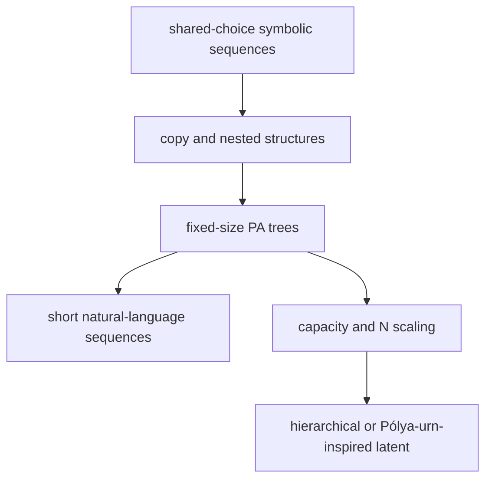

# Experimental protocol

## Separation of questions

The notebook reports three distinct evaluations:

1. Mean-latent reconstruction asks whether the encoder and decoder can represent held-out complete
   graphs. It is not fresh generation or likelihood.
2. Prior generation asks whether seeded standard-normal latents decode into a distribution resembling
   held-out NetworkX graphs.
3. Determinism tests establish the API contract, not learned preferential attachment.

Poor reconstruction points to representation, decoder, or optimization limits. Good reconstruction
with poor prior samples points to prior matching or latent geometry. Structurally valid but
distributionally wrong graphs show that representation-enforced validity is not process fidelity.

## Comparator

The independent-parent baseline estimates a categorical parent distribution separately for each
arrival from training data, with 0.5 additive smoothing. It preserves arrival-specific marginals,
always produces a valid tree, and is deterministic under keyed sampling. It has no shared graph-level
random variable, so it removes the dependency mechanism under investigation.

## Required evidence

| Measurement | Purpose |
|---|---|
| Reconstruction cross-entropy and accuracy | Representation diagnostic |
| Degree frequencies | Coarse marginal structure |
| Maximum degree and leaf fraction | Hub and tree-shape variation |
| Mean degree by arrival ID | Age effects |
| Root degree at `N/2` versus later gain | Reinforcement dependence |
| Query-order and reload assertions | Stateless public contract |
| Scalar and full-graph timing | Honest computation accounting |

For reinforcement, Pearson correlation is computed across independent graphs for node 1 only. A
200-resample graph-level bootstrap interval gives a minimal indication of uncertainty. Zero-variance
cases are undefined, not zero.

Degree histograms alone are insufficient. For `m=1`, all outputs are trees with zero triangle
clustering, so clustering is not discriminative. Finite NetworkX samples are the reference; asymptotic
BA formulas are not treated as exact for `N=64`.

## Acceptance boundary

Implementation acceptance requires simulator round trips, valid masking and finite gradients, at
least one parameter update, deterministic `(seed,query)` answers across query schedules, reload
without encoder or data, and valid generated trees. Metric quality is reported rather than made a
hard gate. A weak smoke result is scientifically acceptable and should motivate diagnosis before
architectural complexity.

## Experiment ladder

For this repository, run the smoke setting first, then the documented demo setting. Next vary latent
capacity and `N` while measuring cold query cost and dependency fidelity. Only then compare stronger
decoders, alternative priors, or hierarchical representations.

